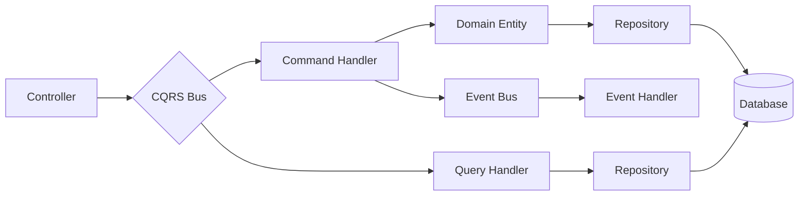
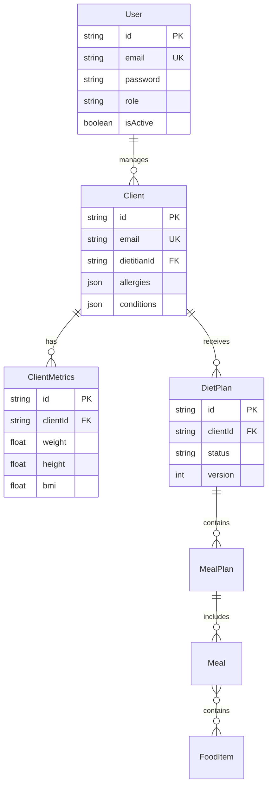

🏗️ Architecture - Diet Management System

🎯 Overview

This document describes the architecture of the Diet Management System, implemented with NestJS for backend, Next.js for web frontend, React Native for mobile frontend, and PostgreSQL as the database. The system follows Clean Architecture principles, CQRS pattern, and Domain-Driven Design.

📂 Monorepo Structure

/diet-app/
│
├── apps/
│   ├── web/                # Next.js (Dietitian portal)
│   ├── mobile/             # React Native (Client app)
│   └── api/                # Nest.js (Backend API)
│
├── packages/
│   ├── domain/             # Domain Layer (Entities, Value Objects, Policies)
│   ├── application/        # Application Layer (UseCases, DTOs, Interfaces)
│   ├── infrastructure/     # Infrastructure (PostgreSQL, Auth, Messaging)
│   ├── ui/                 # Shared UI components (Radix, Tailwind, RN UI)
│   └── config/             # Shared configs (eslint, tsconfig, tailwind, etc.)
│
├── tools/
│   ├── devops/             # CI/CD scripts (GitHub Actions, Dockerfiles)
│   └── scripts/            # Utility scripts (migration, seeding)
│
├── pnpm-workspace.yaml
├── package.json
└── README.md

🧩 Layers

Domain Layer

Entities: User (Admin, Dietitian), Client, DietPlan, Meal

Value Objects: Email, NutritionalInfo, Schedule

Policies: RBAC (Admin vs Dietitian vs Client)

Application Layer

UseCases: CreateDietPlan, AssignClientToDietitian, UpdateMealSchedule

DTOs: DietPlanDTO, ClientDTO

Interfaces: IDietPlanRepository, IClientRepository

Infrastructure Layer

Database: PostgreSQL via Prisma ORM

Repositories: Prisma implementations of repositories

Auth: JWT strategy (NestJS Passport), RBAC guards

Messaging (optional): Event bus (future Azure Service Bus)

Persistence: Local PostgreSQL, migrations via Prisma

Presentation Layer

Web (Next.js): Dietitian portal → manage clients, diet plans

Mobile (React Native): Client app → view diet plan, meals, notifications

API (Nest.js): REST endpoints, OpenAPI docs, health checks

🔑 Key Design Decisions

Clean Architecture: Separation of concerns across domain, application, infrastructure, and presentation.

CQRS: Commands for mutations (e.g., CreateDietPlan), Queries for reads (e.g., GetClientDietPlans).

DDD: Rich domain models encapsulating business rules.

Repository Pattern: Abstract interfaces in application layer, Prisma implementations in infrastructure.

RBAC: Role-based guards for Admin, Dietitian, Client.

📊 Data Model (PostgreSQL)

Tables

Users: id, role, email, passwordHash

Clients: id, dietitianId, healthMetrics

DietPlans: id, clientId, dietitianId, createdAt

Meals: id, dietPlanId, name, calories, schedule

Relationships

One Dietitian → Many Clients

One Client → Many DietPlans

One DietPlan → Many Meals

⚙️ Infrastructure & DevOps

Local Development: Docker Compose with PostgreSQL

ORM: Prisma migrations and seed scripts

CI/CD: GitHub Actions for build, test, lint, Docker image build

Deployment: Initially local, later Azure App Service / Kubernetes

🔍 Observability

Logging: Pino logger

Metrics: Prometheus endpoint (future Azure Monitor)

Tracing: OpenTelemetry integration

🧪 Testing Strategy

Unit Tests: Jest for domain and use cases

Integration Tests: Prisma + PostgreSQL test container

E2E Tests: Supertest for API endpoints

Contract Tests: Pact for API compatibility

🚀 Roadmap

Sprint 1: Monorepo setup + NestJS skeleton + PostgreSQL integration

Sprint 2: Auth (JWT, RBAC) + User/Dietitian/Client entities

Sprint 3: DietPlan CRUD + Next.js dietitian portal UI

Sprint 4: React Native client app + meal schedule view

Sprint 5: CI/CD pipeline + observability


# System Architecture

## Overview
The Diet Management System follows **Clean Architecture** principles with **Domain-Driven Design (DDD)** and **CQRS** patterns to achieve high maintainability, testability, and scalability.

## Architecture Layers

### 1. Domain Layer (`packages/domain/`)
The core business logic layer, independent of external concerns.

**Components:**
- **Entities**: Core business objects (User, Client, DietPlan, FoodItem)
- **Value Objects**: Immutable objects (Email, Password, Weight, Height, NutritionalValue)
- **Domain Services**: Business logic that doesn't belong to entities (BMICalculator, NutritionalCalculator)

**Principles:**
- No dependencies on other layers
- Pure business logic
- Framework-agnostic
- Highly testable

### 2. Application Layer (`packages/application/`)
Orchestrates domain logic and defines use cases.

**Components:**
- **Use Cases**: CQRS Commands and Queries
- **Command Handlers**: Execute state-changing operations
- **Query Handlers**: Retrieve data
- **Event Handlers**: React to domain events
- **DTOs**: Data transfer objects for API
- **Interfaces**: Repository contracts (dependency inversion)

**Patterns:**
- CQRS (Command Query Responsibility Segregation)
- Mediator pattern via @nestjs/cqrs
- Repository pattern (interfaces only)

### 3. Infrastructure Layer (`packages/infrastructure/`)
Implements technical concerns and external integrations.

**Components:**
- **Repositories**: Prisma implementations of repository interfaces
- **Database**: Prisma ORM, migrations, connection management
- **Cache**: Redis integration with invalidation strategies
- **Auth**: JWT strategy, guards, decorators
- **Security**: Encryption, input sanitization
- **Middleware**: Logging, correlation ID, rate limiting

### 4. Presentation Layer (`apps/api/src/`)
HTTP API layer with NestJS controllers.

**Components:**
- **Controllers**: REST API endpoints
- **Guards**: Authentication and authorization
- **Filters**: Global exception handling
- **Pipes**: Validation and transformation
- **Interceptors**: Caching, logging, transformation

## CQRS Architecture



**Benefits:**
- Separation of read and write operations
- Optimized queries without affecting commands
- Event-driven architecture
- Scalability (can scale reads and writes independently)

## Data Flow

### Command Flow (Write)
```
1. Client Request → Controller
2. Controller → Command (DTO validation)
3. Command → Command Handler
4. Handler → Domain Entity (business logic)
5. Entity → Repository (persistence)
6. Repository → Database
7. Handler → Event Bus (domain events)
8. Event Handlers → Side effects
```

### Query Flow (Read)
```
1. Client Request → Controller
2. Controller → Query
3. Query → Query Handler
4. Handler → Repository
5. Repository → Database (optimized query)
6. Handler → DTO transformation
7. Controller → Client Response
```

## Database Schema



## Security Architecture

### Authentication Flow
```
1. User → POST /auth/login (email, password)
2. API → Validate credentials
3. API → Generate JWT access token (1h)
4. API → Generate refresh token (7d)
5. API → Return tokens + user info
6. User → Store tokens securely
7. User → Include Bearer token in requests
```

### Authorization Layers
1. **JWT Guard**: Validates token
2. **Roles Guard**: Checks user role (ADMIN, DIETITIAN)
3. **Policies Guard**: Fine-grained permissions
4. **Resource Ownership**: Validates access to specific resources

## Caching Strategy

### Cache Layers
```
┌─────────────┐
│   Client    │
└──────┬──────┘
       │
┌──────▼──────┐
│ HTTP Cache  │ (Browser)
└──────┬──────┘
       │
┌──────▼──────┐
│ API Cache   │ (Redis)
└──────┬──────┘
       │
┌──────▼──────┐
│  Database   │ (PostgreSQL)
└─────────────┘
```

### Cache Keys
- Users: `user:{id}`, `users:list:{filters}`
- Clients: `client:{id}`, `clients:list:{dietitianId}:{filters}`
- Diet Plans: `dietplan:{id}`, `dietplans:client:{clientId}`
- Food Items: `fooditem:{id}`, `fooditems:list:{category}`

### TTL Strategy
- User data: 10 minutes
- Client data: 5 minutes
- Diet plans: 15 minutes
- Food items: 1 hour (warmed on startup)

## Performance Optimizations

### Database
- **Connection Pooling**: Prisma connection pool (10 connections)
- **Indexes**: On foreign keys, email, status fields
- **Query Optimization**: Select only needed fields
- **Soft Deletes**: `deletedAt` instead of hard deletes

### API
- **Rate Limiting**: 100 req/15min per IP
- **Response Caching**: Redis with automatic invalidation
- **Compression**: gzip for responses
- **Pagination**: Limit/offset for large datasets

### Monitoring
- **Health Checks**: Liveness and readiness probes
- **Logging**: Structured logs with correlation IDs
- **Metrics**: Request duration, error rates (planned: Prometheus)

## Deployment Architecture

### Development
```
Developer → Docker Compose → PostgreSQL + Redis + API
```

### Production
```
Users → Load Balancer → API Instances (N)
                         ↓
                    PostgreSQL (Primary)
                         ↓
                    PostgreSQL (Replica)
                         ↓
                    Redis Cluster
```

## Technology Stack

### Backend
- **Framework**: NestJS 10+
- **Language**: TypeScript 5+
- **ORM**: Prisma 7+
- **Database**: PostgreSQL 15+
- **Cache**: Redis 7+

### Infrastructure
- **Container**: Docker
- **Orchestration**: Docker Compose (dev), Kubernetes (prod)
- **CI/CD**: GitHub Actions
- **Monitoring**: Pino (logging), Prometheus (metrics - planned)

## Design Patterns

1. **Repository Pattern**: Data access abstraction
2. **CQRS**: Command/Query separation
3. **Mediator**: @nestjs/cqrs bus
4. **Factory**: Entity creation
5. **Strategy**: Multiple auth strategies
6. **Decorator**: Guards, interceptors, custom decorators
7. **Observer**: Event-driven architecture

## Scalability Considerations

### Horizontal Scaling
- Stateless API (JWT tokens)
- Redis for shared cache
- Database connection pooling
- Load balancer ready

### Vertical Scaling
- Efficient queries
- Connection pooling
- Caching strategy
- Lazy loading

## Future Enhancements

1. **Event Sourcing**: Full audit trail
2. **GraphQL**: Alternative API
3. **Microservices**: Split by bounded context
4. **Message Queue**: BullMQ for background jobs
5. **Real-time**: WebSockets for notifications
6. **Multi-tenancy**: Support multiple organizations
